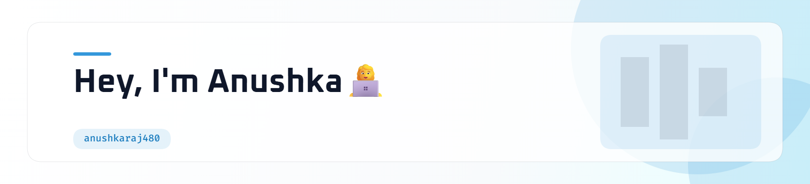

<table align="center" width="100%">
<tr>
<td width="50%" valign="top">
  <picture>
    <source media="(prefers-color-scheme: dark)" srcset="header-dark.png">
    
  </picture>
</td>
<td width="50%" valign="top">
  
</td>
</tr>
</table>

  

### 👋 About Me

I'm a Pre-final Year Computer Science student dedicated to building end-to-end scalable software with clean UI, robust backend systems and integrating AI together.

- 🎓 Currently pursuing **B.E.** at **Dayananda Sagar Academy of Technology and Management.**
- 💻 Currently Working on **SentiVue: A spatial analytics canvas for visualizing customer journeys, sentiment, drop-offs, and AI-powered experience insights.**
- 🌱 Exploring **Machine Learning, System Design and DSA problem-solving skills.**
- 🚀 Building projects around **web applications, REST APIs, AI-powered solutions, and developer tools.**
- 🔬 Interested in **scalable backend architecture, AI and Machine Learning.**
- 🎨 An artist at heart who enjoys **sketching, digital art, and thoughtful UI design.**
- 🤝 Open to **collaborations, internships & interesting projects**
  
> *"Code is not just about solving problems, it's about creating possibilities."*

